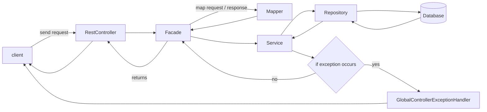

# Template for spring REST application

## Get started

In order to run the project, you need to run the following commands:

```shell
# clone the project
git clone git@github.com:heavynimbus/template-spring-rest.git
cd template-spring-rest

# build the project
mvn install

# run the project
docker-compose up -d --build # start the database
mvn spring-boot:run
```

Then you can access the application at `http://localhost:8080`.

An auto-generated swagger documentation is available [here](http://localhost:8080/swagger-ui).

## Code structure

The code is structured in the following way:

* `controller` packages contains the REST controllers
    * REST controllers are only used to receive requests, call the facade and send responses
* `dto` packages contains the data transfer objects
    * DTOs are objects that are received and sent by the REST controllers
* `facade` packages contains all business features
    * Facades are used to call the services and map the request / response objects
* `mapper` packages contains the mapper classes
    * Mappers are auto-generated classes that are used to map objects
* `service` packages contains the service classes
    * Services are used to call the repositories and throw exceptions if necessary
* `entiy` packages contains the entity classes (database relations) and repositories
    * Each entity represent a table in the database
    * Relations between entities are defined in the entity classes by annotations
    * Repositories are auto-generated classes that are used to access the database
* `config` packages contains the configuration classes
* `exception` packages contains the custom exception classes


