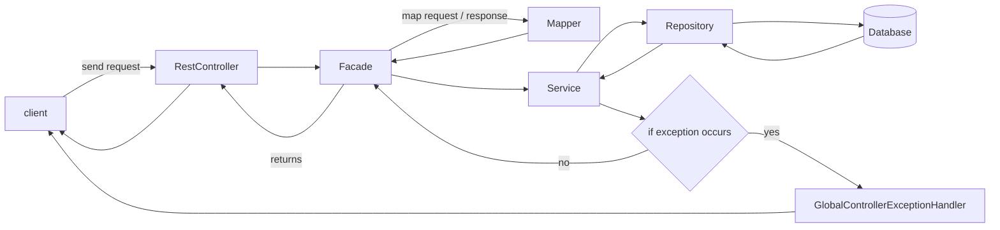

# Template for spring REST application

## Get started

```shell
# clone the project
git clone git@github.com:heavynimbus/template-spring-rest.git
cd template-spring-rest

# build the project
mvn install

# run the project
docker-compose up -d --build # start the database
mvn spring-boot:run
```

## Code structure

The code is structured in the following way:
 * `config` packages contains the configuration classes
 * `controller` packages contains the REST controllers
 * `dto` packages contains the data transfer objects
 * `exception` packages contains the custom exception classes
 * `entiy` packages contains the entity classes (database relations) and repositories
 * `service` packages contains the service classes
 * `mapper` packages contains the mapper classes
 * `facade` packages contains all business features


